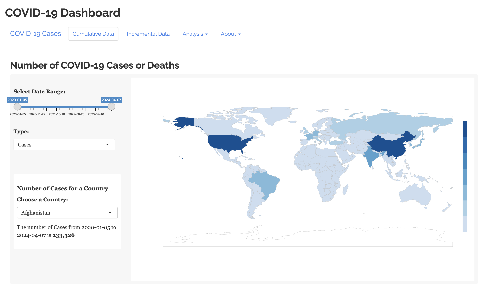
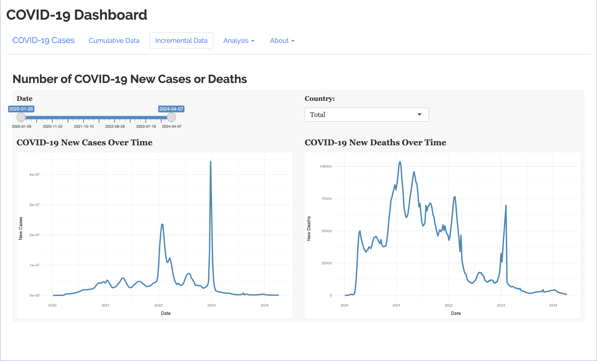

# COVID-19_Dashboard

<!-- badges: start -->

<!-- badges: end -->

This dashboard is designed to visualize both cumulative and incremental COVID-19 cases or deaths worldwide.

-   For cumulative data, we utilize maps to illustrate the total number of cases or deaths across different regions for selected time periods;

  

-   For incremental data, line plots are used to track the fluctuations in new cases and deaths over time in a specific country.

  

## [Data](data)

The [**raw**](data/raw) folder contains raw data stored in CSV format:

-   [01-COVID-19_global_data.csv](data/raw/01-COVID-19_global_data.csv)

    This file recorded COVID-19 cases and deaths weekly from 05/01/2020 to 07/04/2024, which derived from [WHO COVID-19 dashboard data](https://data.who.int/dashboards/covid19/data?n=o) on the [World Health Organization Data](https://data.who.int/).

-   [02-population_countries.csv](data/raw/pctl_of_inc_state_w2.csv)

    This file included the number of population in 2023 and 2024 for each country from [World Population Review](https://worldpopulationreview.com/).

-   [03-population_countries_before_22.csv](data/raw/03-population_countries_before_22.csv)

    This file recorded the number of population from 2020 to 2022 for each country from [Data Bank, World Development Indicators](https://databank.worldbank.org/reports.aspx?source=2&series=SP.POP.TOTL&country=#advancedDownloadOptions).

Also, a detailed description ([About_data.md](data/raw/About_data.md)) of main variables for these three files is contained in the same folder.
