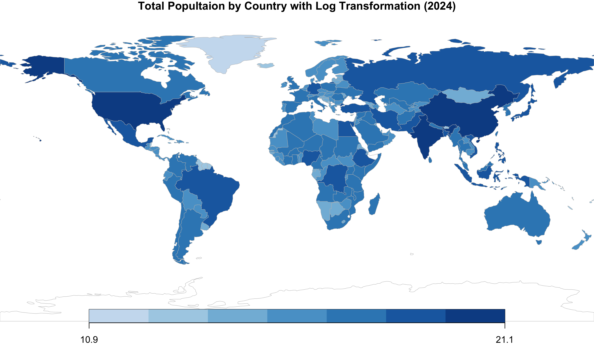
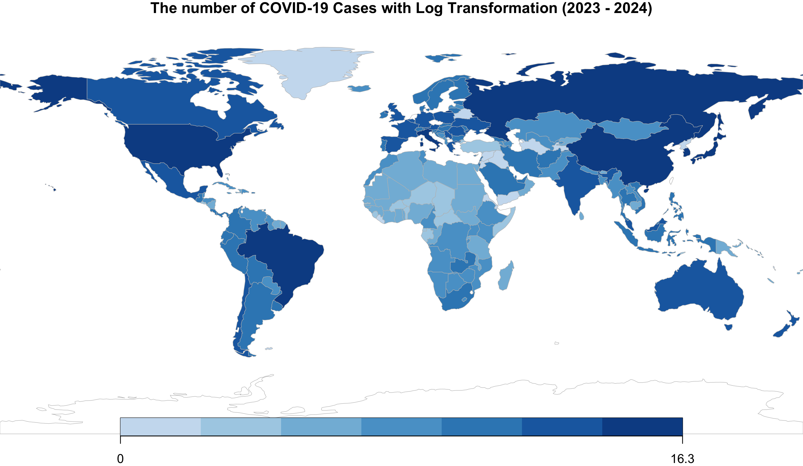
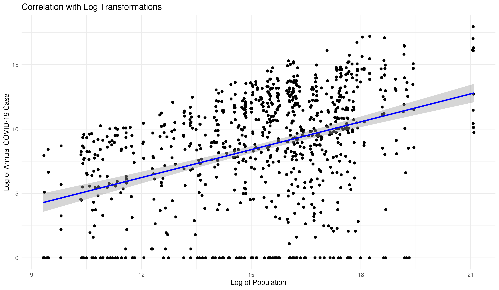

The following two maps display population figures by country for 2024 and the number of COVID-19 cases from 2023 to 2024. Additionally, we have fitted a correlation model to analyze the relationship between population sizes and COVID-19 cases from 2020 to 2024.

The left map provides a visual representation of global population distribution in 2024, using a log transformation to rescale and enhance visual clarity for countries with smaller populations. It is worth noting that India and China have large populations, while Australia, Canada and parts of Africa and South America show medium or low population densities.

The right map illustrates the distribution of COVID-19 cases from 2023 to 2024, also applying a log transformation to present the data more uniformly across regions. The darker-colored regions, including the United States, Brazil, the Russian Federation, and China, indicate ongoing hotspots for the spread of the virus.

{width="47%"} {width="47%"}

Additionally, we observed a statistically relationship between the logarithm of population sizes and the logarithm of annual changes in COVID-19 cases. The positive trend shown by the linear regression line (with a correlation coefficient \$\\rho\$ about 0.3902) suggests that as the number of COVID-19 cases increases as the population increases. This correlation hightlights the challenges associated with controlling the spread of the virus in densely populated areas.

As global populations grow, especially in urban areas, challenges in managing infectious are expected to increase, requiring a stronger healthcare infrastructure and proactive pandemic planning. Historical data from 2023 to 2024 indicates the persistence of disease hotspots in densely populated areas, suggesting these patterns will continue without significant public health strategy changes or improvements in vaccine coverage. Therefore, efforts to manage healthcare capacity and public health interventions should continue to be reinforced, with a particular focus on enhancing healthcare accessibility and disease surveillance in densely populated regions. This approach is essential for effectively managing future health crises.

{width="90%"}

