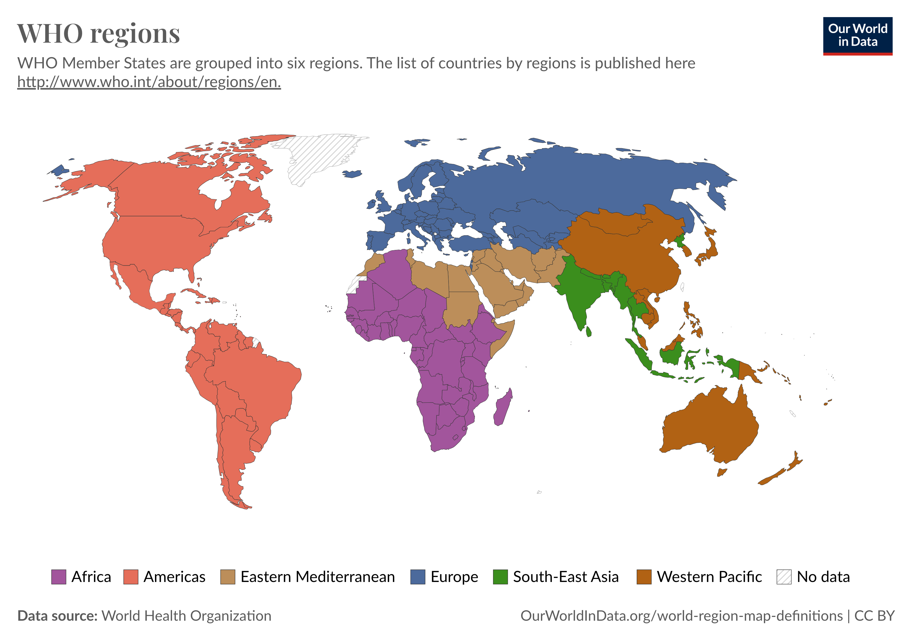

# About data

## COVID-19 Data

Firstly, we outline the key variables found in the raw data derived from the [WHO COVID-19 dashboard data](https://data.who.int/dashboards/covid19/data?n=c). We focus on the dataset [01-COVID-19_global_data.csv](01-COVID-19_global_data.csv), which compiles weekly reports of cumulative and incremental COVID-19 cases and deaths submitted to WHO. The data spans from 05/01/2020 to 07/04/2024 and includes details for each country.

The main variable shows below:

-   `Date_reported`: The date on which cases and deaths were reported, covering a weekly timeframe from 05/01/2020 to 07/04/2024.

-   `Country_code`, `Country`: The codes and names of the countries reporting the data.

-   `WHO_region`: Abbreviations for [WHO regions](https://ourworldindata.org/grapher/who-regions), including:

    -   **AFRO**: Regional Office for Africa;

    -   **AMRO**: Regional Office for the Americas;

    -   **SEARO**: Regional Office for South-East Asia;

    -   **EURO**: Regional Office for Europe;

    -   **EMRO**: Regional Office for the Eastern Mediterranean;

    -   **WPRO**: Regional Office for the Western Pacific;

    -   **Others**: Additional regions not categorized in the aforementioned list.

        

-   `New_cases` and `New_deaths`: Weekly increments reported for new cases and deaths. These figures are subject to retrospective corrections to ensure accuracy based on new information received, sometimes resulting in negative values.

-   `Cumulative_cases` and `Cumulative_deaths`: The total number of confirmed cases and deaths from COVID-19 up to the reporting date.

## Population Data

Secondly, we collect population data by country form 2020 to 2024, sourced from the websites [World Population Review](https://worldpopulationreview.com/) and [Data Bank, World Development Indicators](https://databank.worldbank.org/reports.aspx?source=2&series=SP.POP.TOTL&country=#advancedDownloadOptions). Here, we will briefly introduce the main variables contained in the files [02-population_countries.csv](02-population_countries.csv) and [03-population_countries_before_22.csv](03-population_countries_before_22.csv).

For the file [02-population_countries.csv](02-population_countries.csv), we concentrate on the following columns:

-   `pop2023`, `pop2024`: These columns represent the approximate population figures by country for the years 2023 and 2024, respectively.

-   `country`: This column lists the names of the countries.

For the file [03-population_countries_before_22.csv](03-population_countries_before_22.csv), we focus on following columns:

-   `X2020`, `X2021`, `X2022`: These columns represent the approximate population figures by country for the years 2020, 2021 and 2022, respectively.

-   `Country.Name`: This column lists the names of the countries.
