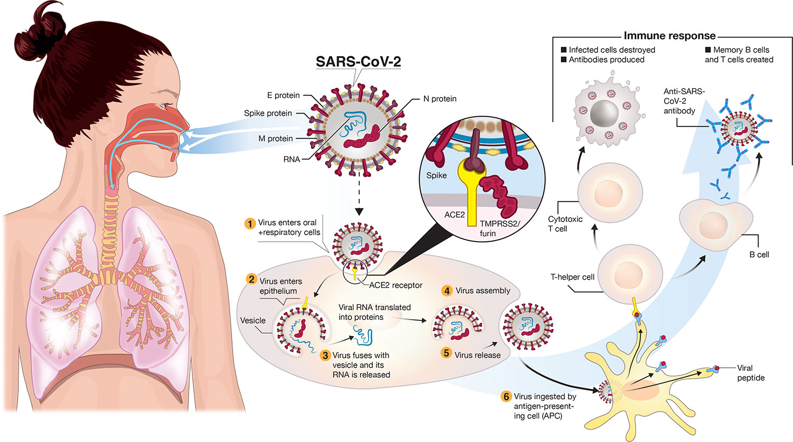
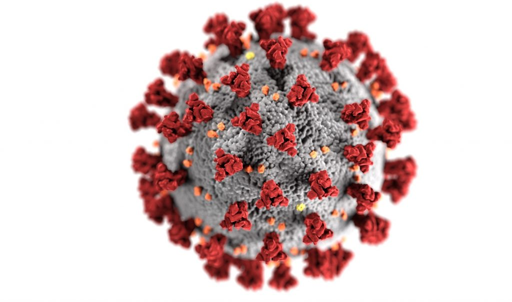

[COVID-19](https://en.wikipedia.org/wiki/COVID-19), officially known as the coronavirus disease 2019, is a contagious disease caused by the coronavirus SARS-CoV-2. COVID-19 manifests with a range of symptoms, including fever, cough, and difficulty breathing, though many individuals may remain asymptomatic. The virus primarily spreads through respiratory droplets from coughs, sneezes, or talking, and it can also survive on surfaces to a lesser extent.

The global response to COVID-19 has included widespread testing, social distancing measures, mask mandates, and the development and deployment of vaccines at an unprecedented scale. These vaccines have become a central element of public health strategies aimed at controlling the spread of the virus and reducing severe outcomes. Despite these efforts, COVID-19 has had significant social, economic, and health repercussions worldwide, affecting every aspect of daily life and highlighting the interconnections of global communities as well as disparities in healthcare infrastructure and access.

&nbsp;

