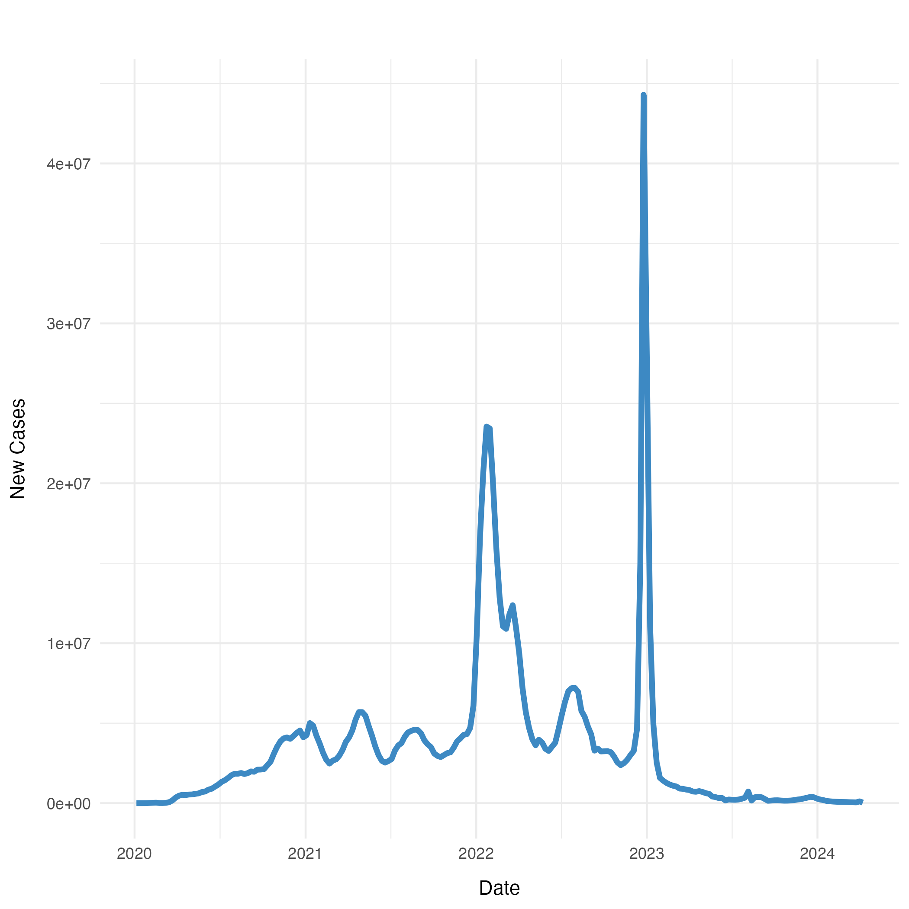

The following plots illustrate the trends of new COVID-19 cases and deaths over time, capturing the volatility and rebound of the pandemic at various intervals.

The left plot tracks new cases and shows clear spikes, especially in mid-2021, early 2022, and a massive spike in mid-2023. These peaks potentially correspond to the appearance of new variants or the relaxation of public health measures, which led to increased transmission rates. After the last peak in 2023, the trend shows a significant decrease, indicating a reduction in cases. This decline could be due to increased immunity, improved disease management, or seasonal effects.

Similarly, the right plots tracks new deaths and exhibits sharp increases that generally slightly after the largest cases spikes. This pattern is expected as an increase in the number of deaths usually lags behind the surge in cases, due to the time it takes for the disease to progress and for severe cases to emerge. Like the cases, the death rates also show a decrease following the last major peak. These peaks are not always proportional to case numbers, suggesting the advancements in treatment.

Looking ahead, the downward trend towards in both plots suggest a continuation of the decline in both cases and deaths if current conditions persist, bolstered by ongoing vaccination efforts, natural immunity in the population, and potentially less virulent emerging variant. However, we still emphasize the the necessity for continuous vigilance and preparedness against potential new outbreaks.

{width="45%"} {width="45%"}

