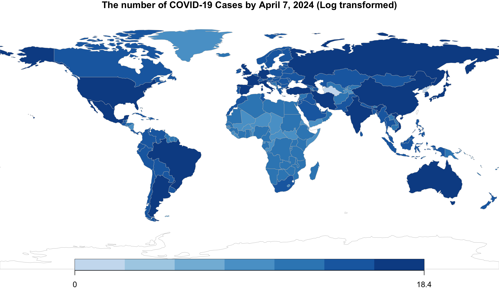
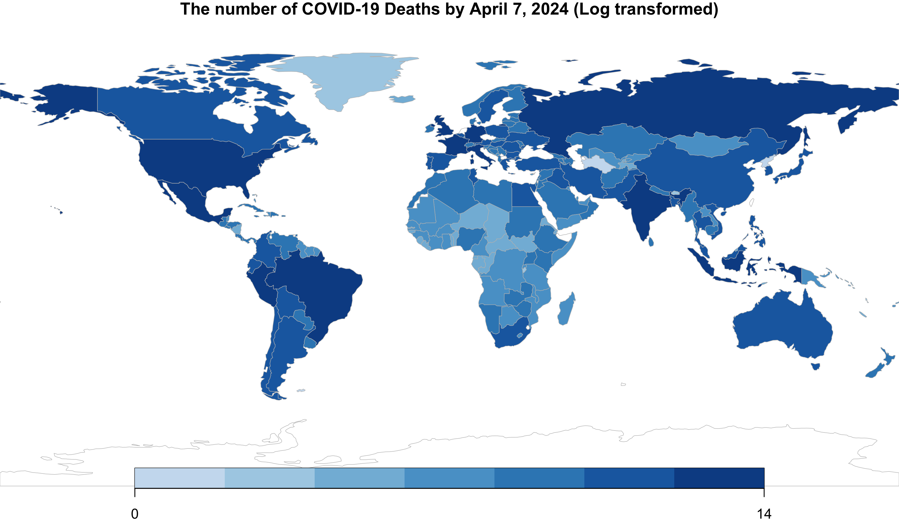

The following two maps depict the number of COVID-19 cases and deaths from 05/01/2020 to 07/04/2024, illustrating the clear regional differences in the global impact of the epidemic.

The left map, which displays COVID-19 cases using a log transformation, highlights significant regional disparities in case worldwide. The hardest-hit areas, such as the United States, India and China, are highlighted, suggesting that these areas have the highest number of cases. This may reflect factors such as population density and differing public health responses, particularly in the [United States](https://en.wikipedia.org/wiki/U.S._state_and_local_government_responses_to_the_COVID-19_pandemic), where responses vary from state to state. In Asia, the substantial numbers in India and China likely result from both dense urban populations and widespread transmission. Also, Western European countries like the UK and France experiencing higher incidences, which may due to these countries are centers of international travel. In contrast, Africa and South America have lower number of cases, which may indicate a lower rate of transmission or problems such as underreporting and low detection rates.

The right map of COVID-19 deaths also shows some regional difference. Darker shades in the United States and parts of Europe (e.g., Italy and the United Kingdom) indicate a high number of deaths in those areas. These higher rates stem from many factors, including a higher prevalence of comorbidities, [a demographic with a larger elderly population](https://data.oecd.org/pop/elderly-population.htm), and differences in the effectiveness of health-care responses. In contrast, Africa shows lower death counts, which might be influenced by the continent's younger demographic and the virus usually affects them less severely or have different health reporting standards.

As the global community navigates forward, the progress in cases and deaths will be influenced by several key factors. For example, population size, which will be further analyzed in the correlation section, and vaccination rates: [regions with higher rates of vaccination](https://ourworldindata.org/covid-vaccinations) are likely to experience fewer cases and deaths. Also, the regional differences suggest international cooperation is essential for global pandemic management. As vaccination programmes advance and treatments improve, a gradual decline in the number of cases and deaths is expected globally. However, the emergence of new variants and addressing the long-term health effects known as 'long COVID' maypresent continuous challenges. These maps highlight regional difference and suggest the necessity for sustained international collaboration to effectively address ghe immediate and long-term consequences of the pandemic.

{width="47%"} {width="47%"}

